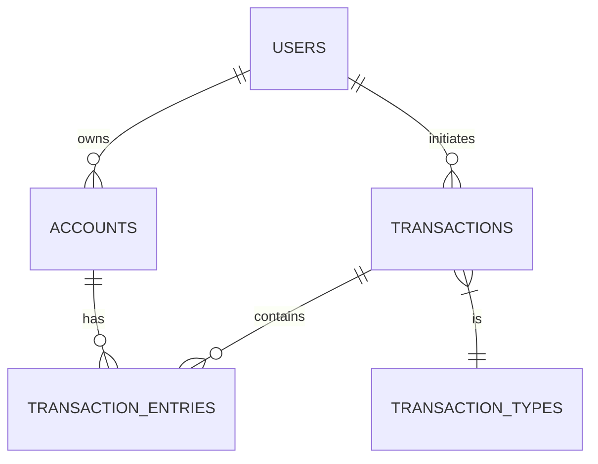

# FinTech Core Banking Ledger System 🏦

 
 
 


A professional-grade Banking Ledger System implemented in **Pure SQL**, demonstrating advanced backend engineering concepts including **Double-Entry Bookkeeping**, **ACID Transactions**, **Forex Engine**, and **Automated Banking**.

---

## 🌟 Why This Project?

This is not a simple CRUD application. It simulates the database architecture of a real-world bank.
It solves complex financial challenges such as:

*   **Financial Integrity**: How to ensure money is never destroyed or created out of thin air? (Solution: *Double-Entry Ledger*)
*   **Concurrency**: How to handle two simultaneous withdrawals of the same balance? (Solution: *Row-Level Locking*)
*   **Auditability**: How to track "who changed what and when" for compliance? (Solution: *Immutable JSON Audit Logs*)
*   **Automation**: How to accrue interest for thousands of accounts daily? (Solution: *MySQL Event Scheduler*)

---

## 🚀 Key Features

### 1. 📖 Double-Entry Bookkeeping
Every single transaction creates at least **two ledger entries** (Debit/Credit).
*   **Zero-Sum Principle**: `SUM(Debits) + SUM(Credits)` = `0`.
*   **Denormalization**: Real-time balances are stored for performance but verified against the ledger history.

### 2. 🛡️ ACID Compliant Transactions
All transfers are wrapped in atomic transaction blocks using `START TRANSACTION`.
*   **Safety**: If any step fails (e.g., insufficient funds), the entire operation `ROLLBACK`s.
*   **Consistency**: Uses `SELECT ... FOR UPDATE` to lock accounts during processing.

### 3. 💱 Multi-Currency Forex Engine
Supports seamless transfers between different currencies (USD, EUR, INR).
*   **Real-Time Conversion**: System looks up the latest rate in `currency_rates`.
*   **Math**: `TargetAmount = SourceAmount * (TargetRate / SourceRate)`

### 4. 🦾 Automated Daily Interest
A strict "End of Day" process runs automatically at midnight.
*   **Event Scheduler**: MySQL native scheduling (Cron-like).
*   **Batch Processing**: Iterates through savings accounts and credits 5% APY interest.

### 5. 🔐 Enterprise Security (RBAC)
Implements strict separation of duties using Database Roles.
*   `teller_bot`: Can execute transactions but **cannot** view audit logs.
*   `auditor_bot`: Can view compliance logs but **cannot** move money.

---

## 📂 Architecture Overview



### Directory Structure

| Folder | Content | Description |
|:-------|:--------|:------------|
| `schema/` | `01_tables.sql` | Core Schema (Users, Accounts, Ledger) |
| | `02_currencies.sql` | Exchange Rates table |
| `procedures/` | `01_transactions.sql` | **The Brain**. Atomic Transfer Logic. |
| | `03_forex_transfer.sql` | Cross-currency logic. |
| `triggers/` | `01_audit_logging.sql` | JSON-based audit trails. |
| | `02_fraud_checks.sql` | Negative balance prevention. |
| `events/` | `01_daily_interest.sql` | Automated Batch Jobs. |
| `views/` | `01_financial_reports.sql` | Balance Sheets & Statements. |
| `security/` | `01_roles.sql` | RBAC Config. |

---

## 🛠️ Installation & Usage

### Prerequisites
*   MySQL 5.7 or 8.0+
*   Terminal / Command Line

### Quick Start (One-Click)

1.  Clone the repository:
    ```bash
    git clone https://github.com/punit745/FinTech_Banking_System.git
    ```
2.  Run the automated setup script:
    ```powershell
    cd FinTech_Banking_System/scripts
    setup.bat
    ```
3.  Enter your MySQL root password when prompted.

---

## 🧪 Simulation Examples

Once installed, you can query the system to see the magic happen.

**1. View the General Ledger:**
```sql
SELECT * FROM transactions WHERE status = 'completed' LIMIT 5;
```

**2. Check Customer Statement:**
```sql
-- See the story of Alice's money
SELECT * FROM vw_customer_statement WHERE username = 'alice';
```

**3. Verify Ledger Integrity (Should return Empty):**
```sql
-- If this returns rows, math is broken!
SELECT * FROM vw_ledger_integrity_check;
```

---

## 👨‍💻 Author

**Punit Pal**
*   [GitHub Profile](https://github.com/punit745)
*   **Specialty**: Backend Systems, Database Architecture, Financial Tech.

---

*This project is for educational portfolios and demonstrates production-level SQL patterns.*
